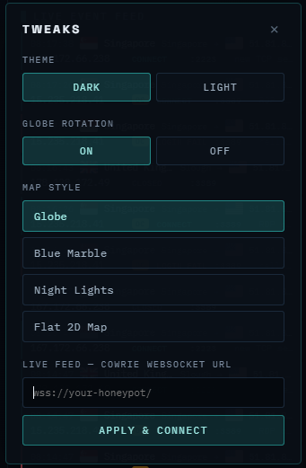
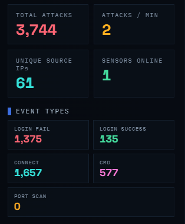
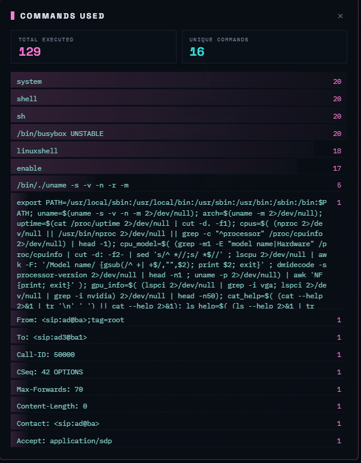
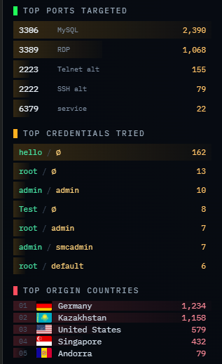
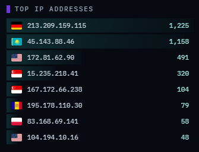
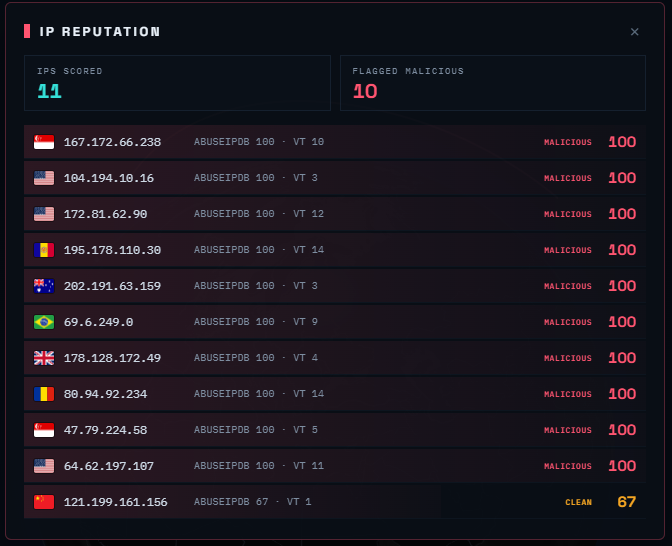
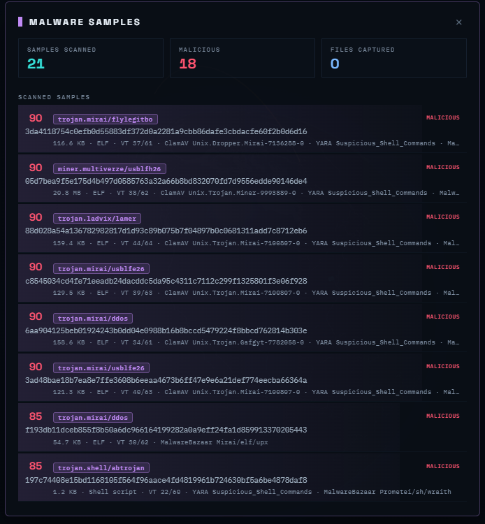

# HoneyRadar

> 🤖 Disclaimer: This is a vibe-coded project.

A real-time honeypot threat intelligence map using [Cowrie](https://github.com/cowrie/cowrie), [OpenCanary](https://github.com/thinkst/opencanary), [Tailscale](https://tailscale.com/), and IP reputation enrichment. It renders incoming attacks as animated arcs on an interactive 3D globe threat map, alongside live event feed, and raw Cowrie and OpenCanary log lines.

https://github.com/user-attachments/assets/5c883e28-f398-4701-b3e9-914b16c8887a

## Features

- **3D globe** and **Flat 2D world map** with animated attack arcs, sensor pulses, and impact rings. Click-drag to rotate, scroll to zoom, plus an optional **auto-rotate** toggle in TWEAKS.
- **Map styles:** Globe, Blue Marble, Night Lights, and Flat 2D.
- **Dark / Light theme** across the whole interface.



- **Auto-discovered honeypot sensors** upon applying the honeypot's WebSocket URL, geolocated and placed on the map automatically with activity.
- **Live event feed** per event: timestamp, source country + city, flag, target sensor, port, source IP, event type, and detail.
- **Click any event for the full record:** Selecting a row in the feed opens an **Event Detail** panel showing the full JSON for that event.
- **Filter & search**: search the live feed by IP, country, user, command, or type; toggle event types on/off; or show only malicious sources. Non-matching attacks are hidden on the globe and 2D map too.
- **Attacker profile**: click any source IP for a per-IP dossier: geo / ISP / ASN, reputation, event-type breakdown, top credentials / commands / ports, first & last seen, and recent activity.
- **History (stored logs)** — with the optional SQLite backend (see [`HONEYRADAR_BACKEND.md`](HONEYRADAR_BACKEND.md)), a **History** panel searches and paginates *all* events over days/weeks: full-text search, date range, source / event-type / malicious filters, and click-through to the Event Detail.
- **Updated counters:** total attacks, attacks/min, unique source IPs, sensors online, login fails, login success, connection attempts, commands.



- **Commands explorer:** a **Commands Used** panel with total executed, unique-command count, and the most-run commands ranked by frequency.



- **Rankings:** top ports targeted, top source IP addresses, top origin countries, and top credentials tried.




- **IP REPUTATION panel:** scores the top source IPs for maliciousness from server-side enrichment (**Spamhaus DROP, AbuseIPDB, VirusTotal**).


- **Malware sample panel**: opens from the **MALWARE** button: **captured files** (Cowrie uploads/downloads, with time, action, source IP, filename, and URL) plus **scanned samples** (ClamAV / YARA / VirusTotal / MalwareBazaar with score and family). Every row opens the exact Event Detail.



- **Raw logs drawer** streams the `cowrie.json` and `opencanary.log` line for every event, with the option to pause, clear, load a new `.json` file for replay, **and download the captured logs**.
- **Embedded country flags** (offline-safe; no external CDN required).

## Requirements
- VPS Server or any targetted machine (Ubuntu Server 22.04 or 24.04 recommended)
- Tailscale on host machine and VPS Server

## Install on the target machine
- Python 3.10+
- Cowrie And/Or OpenCanary
- Tailscale for private SSH connectivity on server and to create the WebSocket URL
```bash
ssh username@TAILSCALE-VPS-IP
```

## Quick Start

1. Download `HoneyRadar Attack Map.html`. Upon first opening the HTML, the status reads **OFFLINE** and the map is empty. That's expected. It will switch to **LIVE** after applying your honeypot's WebSocket URL and it visualizes real traffic.
2. Open it in any modern browser (Chrome, Edge, Firefox, Safari).

### Setting up the live feed (WebSocket bridge) on the target machine

Cowrie or OpenCanary do not provide a WebSocket URL. You will need to create a small bridge that will broadcast each new logged event to your map. Keep this feed private through Tailscale. **Tailscale Serve** provides HTTPS/TLS and proxies the WebSocket for you.

#### 1. Install the WebSocket library

Run as your administrative `ubuntu` user:

```bash
sudo -u cowrie python3 -m venv /home/cowrie/ws-env

sudo -u cowrie /home/cowrie/ws-env/bin/pip install \
  "websockets==16.0"
```

#### 2. Create the bridge

```bash
sudo nano /home/cowrie/websocket.py
```

Paste the code from [`websocket.py`](https://raw.githubusercontent.com/VortexisTV/HoneyRadar/refs/heads/main/websocket.py).

Correct its ownership:

```bash
sudo chown cowrie:cowrie /home/cowrie/websocket.py
sudo chmod 750 /home/cowrie/websocket.py
```

#### 3. Create a system service

```bash
sudo nano /etc/systemd/system/honeyradar-websocket.service
```

Paste the code from [`honeyradar-websocket.service`](https://raw.githubusercontent.com/VortexisTV/HoneyRadar/refs/heads/main/honeyradar-websocket.service) in this repo:

```ini
[Unit]
Description=Honeypot JSON WebSocket Bridge
After=network-online.target cowrie.service opencanary.service
Wants=network-online.target

[Service]
Type=simple
User=cowrie
Group=cowrie
WorkingDirectory=/home/cowrie/cowrie
Environment=COWRIE_LOG=/home/cowrie/cowrie/var/log/cowrie/cowrie.json
Environment=OPENCANARY_LOGS=/var/tmp/opencanary.log
EnvironmentFile=/etc/honeypot-bridge/reputation.env
ExecStart=/home/cowrie/ws-env/bin/python /home/cowrie/websocket.py
Restart=always
RestartSec=3
NoNewPrivileges=true
PrivateTmp=false

[Install]
WantedBy=multi-user.target
```

[Server-side SQLite persistence so HoneyRadar can keep and search **ALL** events
over days/weeks.](HONEYRADAR_BACKEND.md)

#### 4. Create a protected env file for IP reputation (optional enrichment)
```bash
sudo mkdir -p /etc/honeypot-bridge
sudo nano /etc/honeypot-bridge/reputation.env
```

Put your API keys there:

```env
COWRIE_DOWNLOAD_DIR=/home/cowrie/cowrie/var/lib/cowrie/downloads
HONEYRADAR_MALWARE_LOG=/var/tmp/honeyradar-malware.log
YARA_RULES=/opt/honeyradar/yara/test_rules.yar
SCAN_INTERVAL=10

ENABLE_SPAMHAUS=true
SPAMHAUS_DROP_URL=https://www.spamhaus.org/drop/drop.json

ENABLE_ABUSEIPDB=false
ABUSEIPDB_API_KEY=your_new_abuseipdb_key_here

ENABLE_VIRUSTOTAL=false
VIRUSTOTAL_API_KEY=your_new_virustotal_key_here

ENABLE_OTX=false
OTX_API_KEY=your_otx_key

ENABLE_THREATFOX=false
THREATFOX_AUTH_KEY=your_threatfox_key

MALWAREBAZAAR_AUTH_KEY=your_malwarebazaar_key

REPUTATION_CACHE_TTL_HOURS=24
```
Lock it down:
```bash
sudo chown root:root /etc/honeypot-bridge/reputation.env
sudo chmod 600 /etc/honeypot-bridge/reputation.env
```
#### 5. Add YARA Rules Directory, add test rules, install your Scanner (optional)
Install Local Scanners and Update ClamAV:
```bash
sudo apt update
sudo apt install -y clamav clamav-daemon yara
sudo systemctl stop clamav-freshclam 2>/dev/null
sudo freshclam
sudo systemctl start clamav-freshclam 2>/dev/null
```
Add YARA Rules Directory, add test rules
```bash
sudo mkdir -p /opt/honeyradar/yara
sudo nano /opt/honeyradar/yara/test_rules.yar
```
Paste:
```yara

rule Suspicious_Shell_Downloader
{
    strings:
        $curl = "curl "
        $wget = "wget "
        $chmod = "chmod +x"
        $sh = "/bin/sh"

    condition:
        2 of them
}
```
Install The Scanner
```bash
sudo mkdir -p /opt/honeyradar
sudo nano /opt/honeyradar/honeyradar_sample_scanner.py
```
Paste the code from [`honeyradar_sample_scanner.py`](https://raw.githubusercontent.com/VortexisTV/HoneyRadar/refs/heads/main/honeyradar_sample_scanner.py) in this repo:

Save, and Change file permissions
```bash
sudo chmod 750 /opt/honeyradar/honeyradar_sample_scanner.py
sudo chown root:root /opt/honeyradar/honeyradar_sample_scanner.py
```
Create Scanner Service:
```bash
sudo nano /etc/systemd/system/honeyradar-malware-scanner.service
```
Paste the code from [`honeyradar-malware-scanner.service`](https://raw.githubusercontent.com/VortexisTV/HoneyRadar/refs/heads/main/honeyradar-malware-scanner.service) in this repo:

```INI
[Unit]
Description=HoneyRadar Cowrie Malware Sample Scanner
After=network-online.target
Wants=network-online.target

[Service]
Type=simple
EnvironmentFile=/etc/honeypot-bridge/reputation.env
ExecStart=/usr/bin/python3 /opt/honeyradar/honeyradar_sample_scanner.py
Restart=always
RestartSec=5

[Install]
WantedBy=multi-user.target
```
Start the service:
```bash
sudo systemctl daemon-reload
sudo systemctl enable --now honeyradar-malware-scanner
sudo systemctl status honeyradar-malware-scanner --no-pager -l
```
#### 6. Start the Websocket service
> Before starting the service, make sure the honeypots are started and active!
```bash
sudo systemctl daemon-reload
sudo systemctl enable --now honeyradar-websocket

sudo systemctl status honeyradar-websocket --no-pager
sudo ss -lntp | grep 8765
```

Expected, it's listening on localhost only:

```text
127.0.0.1:8765
```

🚫 **Do not open port `8765` in the VPS firewall.** Tailscale handles access.

#### 6. Publish privately through Tailscale

```bash
sudo tailscale serve --bg 8765
sudo tailscale serve status
```

It should print something similar to:

```text
https://vps-3ab2df8e.YOUR-TAILNET.ts.net
```

Your map's WebSocket URL is the same hostname using `wss://`:

```text
wss://vps-3ab2df8e.YOUR-TAILNET.ts.net/
```

Open **TWEAKS**, paste your honeypot WebSocket URL into **LIVE FEED — COWRIE WEBSOCKET URL**, and click **APPLY & CONNECT**. The device viewing the map must also be connected to your Tailscale network.

### Troubleshooting

*No feed after starting the Websocket service?* Delete the honeypot logs and restart Cowrie/OpenCanary.

### Event format

Each line is one JSON object. The fields the map reads:

| Field | Used for |
| --- | --- |
| `eventid` | Event type / colour (`cowrie.login.failed`, `cowrie.login.success`, `cowrie.session.connect`, `cowrie.command.input`) |
| `src_ip` | Source IP + unique-IP count |
| `dst_ip` | **Identifies / creates the honeypot sensor** (geolocated for placement) |
| `dst_port` | Top Ports Targeted |
| `username`, `password` | Top Credentials Tried (login events) |
| `input` | Command detail (`cowrie.command.input`) |
| `timestamp` | Event time |
| `geoip.latitude` / `geoip.longitude` *(optional)* | Source location for the attack arc; if absent, `src_ip` is geolocated automatically (`lat`/`lon` also accepted) |
| `geoip.country_name`, `geoip.country_code2`, `geoip.city` *(optional)* | Source country label, flag, and city; otherwise filled from geolocation |
| `dst_geoip` / `geoip_dst` *(optional)* | Honeypot location, used instead of IP geolocation |

Example line:

```json
{"eventid":"cowrie.login.failed","src_ip":"61.177.7.20","dst_ip":"203.0.113.10","dst_port":22,"username":"root","password":"123456","timestamp":"2026-06-23T10:00:01.000000Z","geoip":{"country_name":"China","country_code2":"CN","city":"Shanghai","latitude":31.0,"longitude":121.0}}
```

## Built with

- [three-globe](https://github.com/vasturiano/three-globe) / [three.js](https://threejs.org/) — the 3D globe
- [flag-icons](https://github.com/lipis/flag-icons) — embedded country flags
- [Natural Earth](https://www.naturalearthdata.com/) — country boundary data
- [ipwho.is](https://ipwho.is) — source & destination IP geolocation

## License

Not affiliated with the Cowrie or OpenCanary project.
